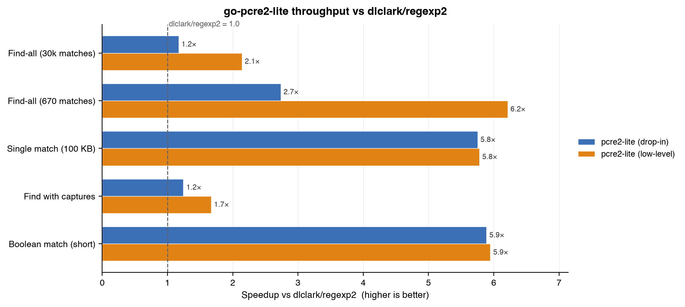
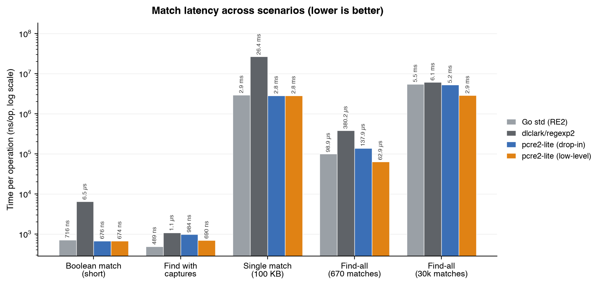
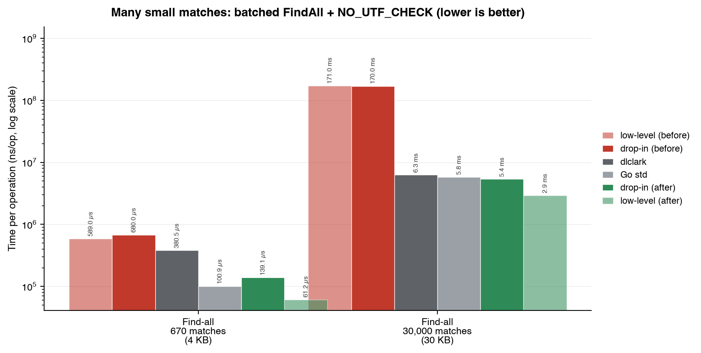
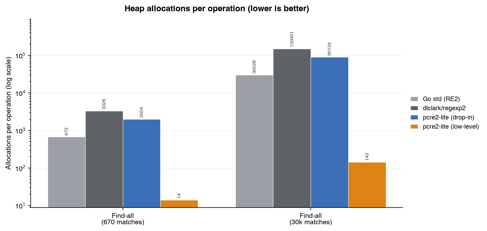

# go-pcre2-lite

[](https://github.com/VillanCh/go-pcre2-lite/actions/workflows/ci.yml)

**English** | [简体中文](README.zh-CN.md)

A high-performance, embeddable regular-expression library for Go, built on a
trimmed **PCRE2 8-bit interpreter** compiled from vendored C source via cgo —
**JIT permanently disabled** — and shipped as a **drop-in replacement** for
`github.com/dlclark/regexp2`.

- **Drop-in `regexp2` compatibility** — usually just change the import path.
- **Faster, lower-allocation** — faster than `dlclark/regexp2` on every
  benchmark (up to ~5.9x), zero-allocation boolean matching, and a batched
  `FindAll` that beats Go's own `regexp` on massive small-match workloads (see
  [Performance](#performance)).
- **ReDoS-safe by default** — bounded by the PCRE2 match/depth limits; a
  catastrophic pattern returns an error instead of hanging.
- **Rich feature set** — capture/named groups, lookahead/lookbehind,
  backreferences, atomic groups, possessive quantifiers, recursion, `\K`,
  subroutine calls, Unicode properties.
- **SQLite-style embedding** — no external libs, no `pkg-config`, no CMake, no
  dynamic linking. `CGO_ENABLED=1` is the only requirement.

## Install

```bash
go get github.com/VillanCh/go-pcre2-lite
```

Requires `CGO_ENABLED=1` and a C toolchain (the PCRE2 C source is vendored and
compiled with the package; JIT is never referenced).

## Usage

### Drop-in `regexp2` replacement (rune-oriented, recommended)

```go
import regexp2 "github.com/VillanCh/go-pcre2-lite/regexp2"

re := regexp2.MustCompile(`(?<area>\d{3})-(?<num>\d{4})`, 0)

// Boolean match (allocation-free hot path).
ok, _ := re.MatchString("call 555-1234")

// First match + named/numbered groups.
m, _ := re.FindStringMatch("call 555-1234")
if m != nil {
    fmt.Println(m.GroupByName("area").String()) // 555
    fmt.Println(m.GroupByNumber(2).String())    // 1234
    fmt.Println(m.Index, m.Length)              // rune index / length
}

// Iterate every match.
for m, _ := re.FindStringMatch("555-1234 / 777-0000"); m != nil; m, _ = re.FindNextMatch(m) {
    fmt.Println(m.String())
}

// Replace ($1 / ${name} templates) and ReplaceFunc.
out, _ := re.Replace("555-1234", "${area}.${num}", -1, -1) // 555.1234
out, _ = re.ReplaceFunc("555-1234", func(m regexp2.Match) string {
    return strings.ReplaceAll(m.String(), "-", " ")
}, -1, -1)

// Escape / Unescape literal text.
lit := regexp2.Escape("a.b*c")

// Defend against adversarial patterns (extension beyond the regexp2 API).
_ = re.SetMatchLimits(100000, 100000)
```

`Index`/`Length` are rune indices, exactly like `regexp2`. No `Close()` is
needed (a finalizer reclaims the C memory), matching `regexp2`'s ergonomics. A
compiled `*Regexp` is safe for concurrent matching.

### Low-level byte API (maximum performance)

```go
import pcre2 "github.com/VillanCh/go-pcre2-lite"

re := pcre2.MustCompile(`\w+@\w+\.\w+`, pcre2.CompileOptions{UTF: true, UCP: true})
defer re.Close() // explicit release; the finalizer is a safety net

ok, _ := re.Match([]byte("a@b.com"))           // allocation-free
m, _ := re.Find([]byte("a@b.com"), 0)          // m.Groups[i] are byte spans
all, _ := re.FindAll([]byte("a@b.com x@y.io"), -1)
```

All offsets in the low-level API are **UTF-8 byte offsets** (vs. rune indices in
the compat layer). Use this layer for the lowest allocation and the fastest
batch `FindAll`.

## Migration from `github.com/dlclark/regexp2`

For the overwhelming majority of code, migration is a one-line import change:

```go
// before
import "github.com/dlclark/regexp2"
// after
import regexp2 "github.com/VillanCh/go-pcre2-lite/regexp2"
```

The exported surface (types, methods, `RegexOptions` constants, rune-based
`Index`/`Length`, `Replace`/`ReplaceFunc`, `Escape`/`Unescape`) mirrors
`regexp2`. Whole-match results agree on **100%** of the 1585-input PCRE2 official
corpus. The behavioural differences to be aware of:

| Area | `dlclark/regexp2` (.NET) | `go-pcre2-lite` |
|---|---|---|
| ReDoS / timeout | `MatchTimeout` = forever by default; can hang | bounded by match/depth limit; returns `ErrMatchLimit` instead of hanging |
| `MatchTimeout` field | enforces a wall-clock abort | accepted for API compat, **not** enforced — use `SetMatchLimits` |
| Mixed named + unnamed group **numbering** | unnamed first, then named | strict left-to-right |
| Repeated-group `Group.Captures` | full capture history | final capture only (`.String()` is identical) |
| `RightToLeft` | real right-to-left scan | accepted but engine always scans left-to-right |

Only group **numbering** with *mixed* named/unnamed groups differs; access by
name (`GroupByName`) is always identical. See [MIGRATION.md](MIGRATION.md) for
the full details and per-difference tests.

## Unsupported / divergent syntax

These are the constructs to check when porting patterns. They fall into three
buckets; the **silent** ones are the dangerous category.

### Rejected at compile time (safe — you find out immediately)

| Construct | Example | Note |
|---|---|---|
| .NET balancing groups | `(?<open>\()[^()]*(?<-open>\))` | .NET-only stack feature; PCRE2 has no equivalent |
| Variable-length lookbehind | `(?<=a+)b`, `(?<=[ab]+)x` | PCRE2 lookbehind must be **fixed length** |
| Long `\p{...}` category names | `\p{Number}`, `\p{IsGreek}` | use the short alias `\p{N}`, `\p{Greek}` (also rejected by `dlclark`) |

### Silently different (compiles, but behaves differently — audit these)

| Construct | Example | `dlclark` (.NET) | `go-pcre2-lite` (PCRE2) |
|---|---|---|---|
| .NET character-class subtraction | `[a-z-[aeiou]]` | "set minus": matches `b`, not `e` | parsed as the class `[a-z\-\[aeiou]` followed by a literal `]`; `b` alone does **not** match |
| Quantified capture in lookbehind | `(?<=(\w){3})def` | group 1 = `"a"` | group 1 = `"c"` (whole match agrees) |
| Backreference inside lookbehind | `(?<=\1(\w))d` | matches | compiles but does **not** match |

### Supported here, but NOT by `dlclark/regexp2` (bonus PCRE2 power)

Possessive quantifiers `a++`, atomic groups `(?>…)`, recursion `(?R)`, `\K`,
and subroutine calls `(?&name)` all compile here and are rejected by `dlclark`.
Patterns relying on these are *not* portable back to `regexp2`.

## Safety: catastrophic backtracking is bounded

Unlike `dlclark/regexp2` (whose default `MatchTimeout` is "forever"), every
match here is bounded by the PCRE2 match/depth limits. A classic exponential
ReDoS such as `(a+)+$` against `"aaaa…!"` returns `ErrMatchLimit` in ~120 ms at
the default limit, and in ~0.6 ms with `SetMatchLimits(50000, …)` — it never
hangs and never overflows the stack (PCRE2 10.x matches on the heap).

The library is tested against real-world JS-ecosystem ReDoS CVEs (moment.js
CVE-2022-31129, Cloudflare-2019, CWE-1333, UAParser.js CVE-2020-7733): all
terminate. Note one caveat — the match limit bounds **exponential** backtracking
but not a **polynomial** (e.g. quadratic) scan; for polynomial patterns the
effective defense is capping input length.

## Performance

Measured with `go test -bench`, `darwin/arm64` (Apple M-series). Three backends
on identical work: `dlclark` = the engine we replace, **drop-in** = this
`regexp2` compat layer (rune output), **low-level** = the byte API. `std` = the
Go standard library `regexp` (RE2), shown where its syntax allows.



The drop-in layer is faster than `dlclark/regexp2` on every benchmark, and the
low-level byte API is faster still (1.2x–6.2x).

| Scenario | dlclark | drop-in | low-level | speedup | drop-in alloc |
|---|---|---|---|---|---|
| Boolean match, short string | 6471 ns | 1099 ns | 1088 ns | **5.9x** | 0 B / 0 |
| Boolean match, 100 KB input | 25.9 ms | 4.51 ms | 4.49 ms | **5.7x** | 0 B / 0 |
| Match w/ backreference | 391 ns | 186 ns | 183 ns | **2.1x** | 0 B / 0 |
| Backtracking-heavy, 32 KB | 20.4 ms | 11.2 ms | 11.1 ms | **1.8x** | 0 B / 0 |
| Unicode `\p{Han}`, 8 KB | 15.6 µs | 12.2 µs | 4.65 µs | 1.3x | 0 B / 0 |
| Find with 6 captures | 1129 ns | 908 ns | 677 ns | 1.2x | 752 B / 7 |
| Compile (complex pattern) | 10.9 µs | ~3.0 µs | 2.95 µs | **3.7x** | 1.5 KB / 17 |
| Find-all, 670 matches | 380 µs | 139 µs | 61 µs | **2.7x** (ll 6.2x) | 193 KB / 2004 |
| Find-all, 30k matches | 6.29 ms | 5.38 ms | 2.94 ms | **1.2x** (ll 2.1x) | 7.8 MB / 90k |



**Boolean matching is allocation-free** on the hot path (0 B / 0 allocs).

### Optimizing massive numbers of small matches

Iterating very many tiny matches over a large subject used to be the one place
the engine lost to pure-Go backtrackers. The cause was not the cgo boundary but
**O(n²) UTF-8 validation**: with `PCRE2_UTF` set, PCRE2 re-validates the *whole*
subject on every `pcre2_match` call, so N matches over an N-byte subject cost
O(N²).

Two changes fixed it:

1. **Batched `FindAll`/iteration** — a single C function (`p2l_match_all`)
   gathers a chunk of matches per cgo call, turning N round trips into
   ⌈N/256⌉ and decoding one backing slice per chunk (low-level `FindAll`
   allocations dropped from 676 to **14** for 670 matches).
2. **Validate-once** — the batched loop validates UTF-8 on its first match and
   then sets `PCRE2_NO_UTF_CHECK`, collapsing the O(N²) revalidation to O(N).

The combined effect on 30,000 tiny matches over 30 KB: the low-level API went
from **171 ms to 2.9 ms** (≈59x) and the drop-in layer from **170 ms to
5.4 ms**, both now **faster than `dlclark` (6.3 ms) and Go's `regexp` (5.8 ms)**.



The batched path also slashes heap allocations, which matters for GC pressure in
long-running services:



### ReDoS cost

`(a+)+$` on a 40-char adversarial input:

| Limit | Result |
|---|---|
| `dlclark`, no timeout | hangs (catastrophic) |
| default match limit | `ErrMatchLimit` in ~120 ms (bounded) |
| `SetMatchLimits(50000, …)` | `ErrMatchLimit` in ~0.6 ms |

Reproduce the numbers and regenerate the figures with:

```bash
CGO_ENABLED=1 go test -bench . -benchmem -run '^$' .   # run benchmarks
python3 tools/benchviz/plot.py                          # regenerate assets/*.png
```

## Compatibility verification

- **`dlclark/regexp2` parity:** 100% whole-match agreement over the 1585-input
  PCRE2 official `testoutput1` corpus, plus dedicated differential tests for
  replace, full iteration, and group access.
- **PCRE2 10.42 ground truth:** match results agree on 761/761 (8-bit) and
  1347/1347 (UTF) cases from PCRE2's own `testoutput2`/`testoutput4` corpora;
  compile accept/reject agrees on 1080/1080 accepted and 286/286 rejected.
- **JavaScript/Node:** ECMAScript `test262` and V8 lookbehind/named-group/
  Unicode-property cases, plus real-world ReDoS CVE safety.

## Testing

```bash
CGO_ENABLED=1 go test ./...            # unit + differential + corpus + safety
CGO_ENABLED=1 go test -race ./...      # data-race free
CGO_ENABLED=1 go test -bench . ./...   # benchmarks vs dlclark and std regexp
```

## Regenerating the vendored PCRE2 source

```bash
./tools/generate-pcre2lite/generate.sh   # download, trim, configure (no JIT)
./tools/verify-generated/verify.sh       # verify the committed sources are reproducible
```

## License

The embedded PCRE2 C source is under the PCRE2 license (BSD-style); see
[THIRD_PARTY_LICENSES/PCRE2-LICENSE](THIRD_PARTY_LICENSES/PCRE2-LICENSE) and the
headers under `internal/pcre2lite/`.

A license for this project's own Go and wrapper code has not been chosen yet —
add a `LICENSE` file before publishing.
